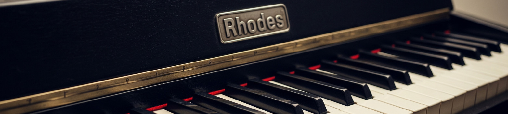

# MDA Rhodes Piano Docker

This project provides a Dockerized environment for running the [MDA LV2 plugins](https://github.com/moddevices/mda-lv2), specifically the Rhodes Piano (mdaEPiano) and a reverb effect. It uses `jalv` to host the LV2 plugins and PipeWire/JACK for audio routing.

## Purpose and Advantages of Dockerization

Dockerizing this setup offers several key advantages, primarily focused on preserving the unique sound and timbre of the MDA Rhodes Piano plugin. By encapsulating the specific version of the plugin and all its dependencies within a Docker container, we ensure:

- **Sound Consistency:** The exact sonic characteristics of the Rhodes Piano are maintained over time, regardless of changes to the underlying operating system or other system libraries. OS upgrades or package updates on the host system will not alter the plugin's behavior or sound.
- **Dependency Management:** All necessary libraries and software components required by the plugin and its host (jalv) are bundled together. This eliminates "dependency hell" and ensures the plugin runs reliably in any environment that supports Docker.
- **Portability:** The Docker image can be easily shared and run on different machines, providing a consistent audio experience across various setups.
- **Reproducibility:** Researchers or musicians can reliably reproduce a specific sound or setup by using the same Docker image.

## Prerequisites

- Docker installed on your system.
- A working audio setup (PipeWire or PulseAudio with JACK compatibility).
- `git` for building the image with the correct commit hash.

## Building the Image

To build the Docker image, navigate to the project's root directory and run the build script:

```bash
./docker/build
```

This will create an image tagged as `ghcr.io/andreimatveyeu/mda_rhodes:latest`.

## Running the Container

To run the Docker container, use the provided run script:

```bash
./docker/run
```

This script handles the necessary Docker arguments to:
- Run the container interactively and remove it on exit (`-it --rm`).
- Set the container name to `mda_rhodes`.
- Map the current user and group.
- Share IPC namespace (`--ipc=host`).
- Grant real-time priority capabilities (`--cap-add=sys_nice --ulimit rtprio=99`).
- Add the user to the `audio` group (gid 17, common for audio access).
- Map sound devices (`/dev/snd`).
- Forward PipeWire and PulseAudio sockets for audio.
- Set the working directory inside the container to `/app`.

Once the container is running, two `jalv` instances will be started:
1. `mda_rhodes`: Hosting the mdaEPiano plugin.
2. `mda_rhodes_reverb`: Hosting a reverb plugin (likely mdaReverb or similar from the mda-lv2 suite).

You will need to use a JACK patchbay (like `qjackctl` or `catia` from `jack-tools`, which is installed in the container) to connect the audio output of these plugins to your system's audio output or other JACK-aware applications.

## Configuration

The LV2 plugin configurations (presets/states) are copied from the `config/` directory into the image at `/app/mda_rhodes/`.
- `config/piano/`: Configuration for the mdaEPiano.
- `config/reverb/`: Configuration for the reverb plugin.

## License

This project is licensed under the terms of the LICENSE file. The MDA LV2 plugins themselves have their own licenses.
